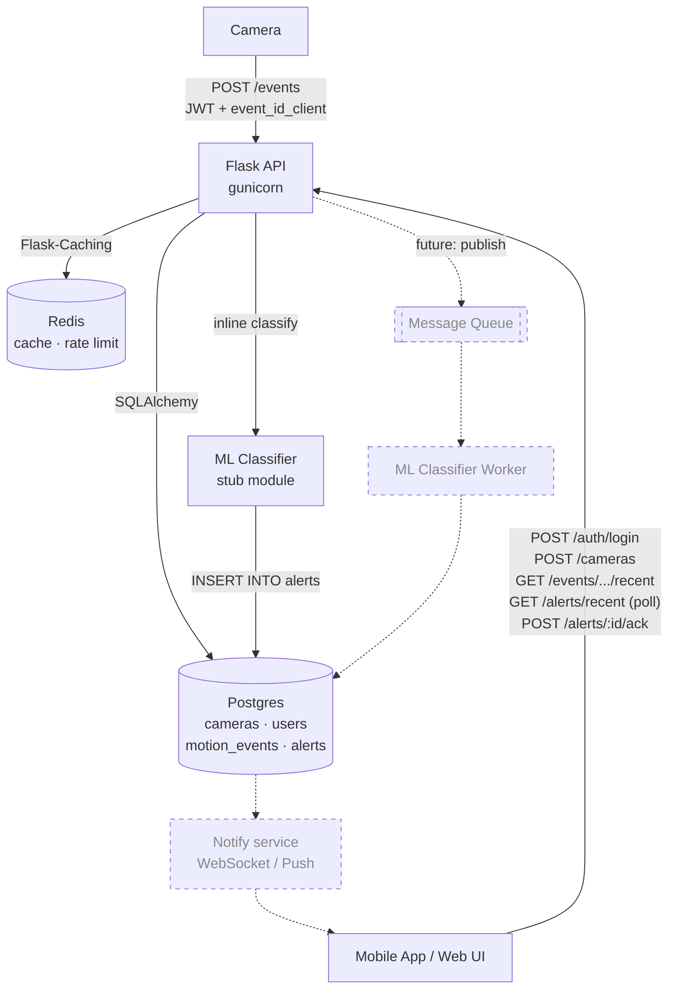
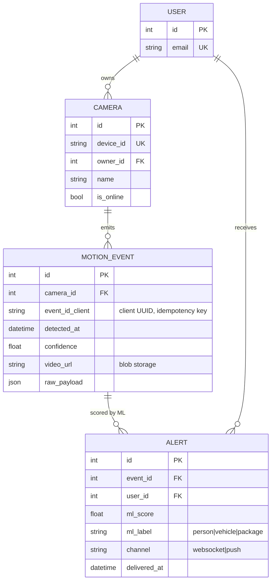
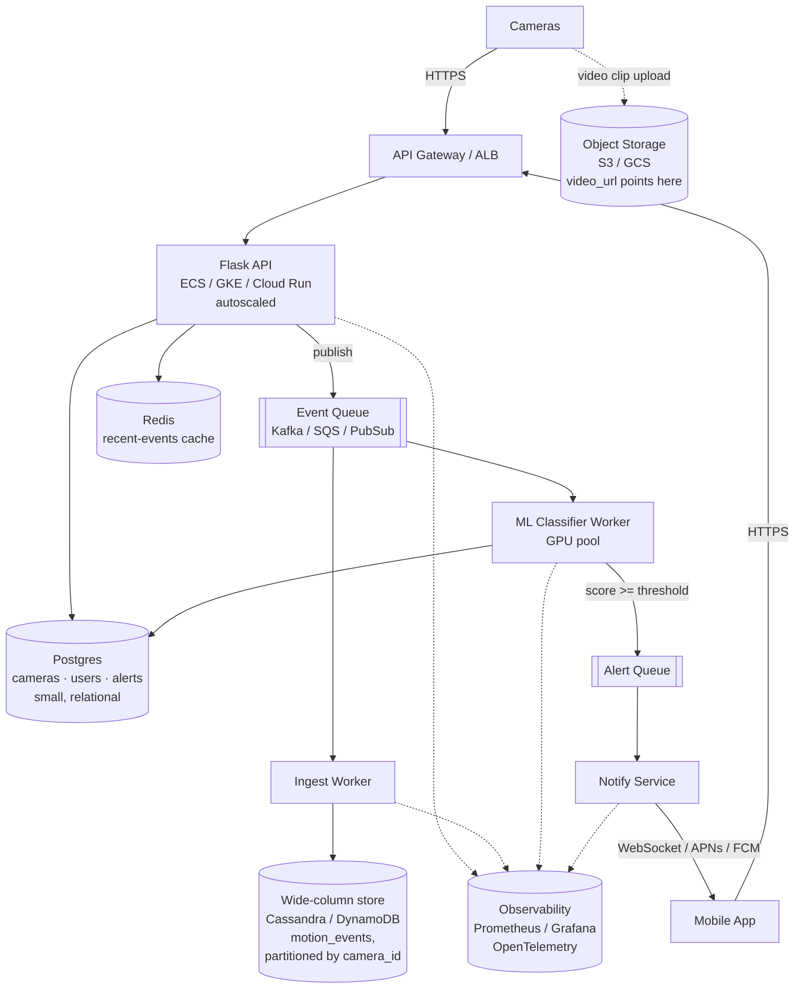

# py-cam-event-service

Flask-based motion-event ingest service for cameras. Receives motion events
from camera devices, persists them to Postgres, and serves recent-event reads
for downstream consumers (mobile app, ML classification pipeline, alerting).

This is the **MVP slice** of a larger home-security architecture. The service
is small and synchronous today, but the API contract and schema are designed
so we can later (1) put a queue in front of the ingest endpoint and
(2) move the events table to a store built for high write volume — without
changing anything on the camera or mobile-app side. See
[Design notes](#design-notes) and [Cloud roadmap](#cloud-roadmap) below.

## Architecture



Solid arrows are implemented in this repo (the classifier is an inline stub
module — see `app/classifier.py`). Dashed arrows are the production
upgrade: the inline classifier moves to a queue consumer, and a notify
service replaces alert polling with real-time push. The schema doesn't
change between the two — `motion_events` stays append-only and ML output
stays on `alerts`, so swapping the dispatch mechanism doesn't touch any
table.

## Data model



`(camera_id, event_id_client)` is unique — a camera retrying after a network
blip lands on the same row instead of duplicating. Replay returns `200` with
the existing event; first writes return `201`.

## Local development

The fastest path is `docker compose up` — it starts Postgres, Redis, runs
`flask db upgrade`, and serves the API on `:8080` with live reload:

```bash
docker compose up --build
# Backend:    http://localhost:8080
# Frontend:   http://localhost:5173
# Jaeger UI:  http://localhost:16686   (distributed traces from the backend)
```

On startup the backend container runs `flask db upgrade` then
`flask seed-admin`, which creates (or resets) an admin user from
`ADMIN_EMAIL` / `ADMIN_PASSWORD` (defaults: `admin@example.com` / `admin`).
Open the frontend, log in with those credentials, and you'll land on the
dashboard described below.

Tear down with `docker compose down` (or `down -v` to also drop the
Postgres volume).

### Trying it out

Log in to get a JWT (8-hour TTL), then use it on subsequent requests:

```bash
TOKEN=$(curl -s -X POST localhost:8080/auth/login \
  -H 'Content-Type: application/json' \
  -d '{"email":"admin@example.com","password":"admin"}' \
  | python -c 'import json,sys;print(json.load(sys.stdin)["access_token"])')

# Register a camera (admin-only)
curl -X POST localhost:8080/cameras \
  -H "Authorization: Bearer $TOKEN" \
  -H 'Content-Type: application/json' \
  -d '{"device_id":"cam-1","name":"Front Door"}'

# Ingest a motion event — re-running with the same event_id_client returns
# the same row (200), not a duplicate (201). That's the idempotency contract.
curl -X POST localhost:8080/events \
  -H "Authorization: Bearer $TOKEN" \
  -H 'Content-Type: application/json' \
  -d '{"device_id":"cam-1","event_id_client":"evt-001","confidence":0.92}'

# Read recent events (cached 15s, invalidated on write)
curl -H "Authorization: Bearer $TOKEN" \
  localhost:8080/events/by-camera/1/recent

# See the alerts the classifier produced (last 24h, scoped to current user)
curl -H "Authorization: Bearer $TOKEN" localhost:8080/alerts/recent

# Ack an alert (sets delivered_at; idempotent)
curl -X POST -H "Authorization: Bearer $TOKEN" localhost:8080/alerts/1/ack
```

Clients (mobile / web) are responsible for storing the token wherever their
platform considers secure — Keychain on iOS, Keystore on Android,
`localStorage` on web — and re-logging-in when it expires.

### Without Docker

If you'd rather run the API on the host:

```bash
python3 -m venv .venv
source .venv/bin/activate
pip install -r requirements.txt

# Postgres (any local install works; this matches the default DATABASE_URL)
docker run -d --name cameras-pg \
  -e POSTGRES_PASSWORD=postgres -e POSTGRES_DB=cameras \
  -p 5432:5432 postgres:16

export FLASK_ENV=development FLASK_APP=wsgi.py
flask db upgrade
flask run --debug --port 8080
```

Without `FLASK_ENV=development`, `wsgi.py` defaults to `production`, which
requires both `DATABASE_URL` and `REDIS_URL` set at import or it fails fast.

## Frontend

`frontend/` is a small React + TypeScript dashboard (Vite, plain CSS modules,
no UI framework) that talks to the Flask API. It has three jobs:

1. **Auth.** `/auth/login` POST → token in `localStorage` → `RequireAuth`
   route guard. The decoded JWT `exp` claim is checked client-side to
   short-circuit obviously-expired tokens; the server is still the source of
   truth and returns 401 if it disagrees.
2. **Surface the data.** Cameras list, camera detail, recent-events table.
3. **Visualize the flow.** A live SVG diagram on the right highlights which
   services each click touches (browser → API → Classifier → Postgres /
   Redis), and a side panel breaks down the server-side steps for the
   most-recent action. Click "New motion event" twice with the same UUID
   to *see* the idempotency contract land — the second response is `200 OK`
   with the same row id, not a duplicate `201`.
4. **Surface the alert pipeline.** The dashboard polls `/alerts/recent` every
   60s; new alerts flash in red and an unread counter sits in the panel
   header. There's a Refresh button for an immediate fetch when you want to
   see a simulated event land. Clicking "Acknowledge" hits
   `POST /alerts/:id/ack` to set `delivered_at`. (Polling stands in for the
   real WebSocket / push channel — see Cloud roadmap.)

### Running on the host (without Docker)

```bash
cd frontend
npm install
VITE_BACKEND_URL=http://localhost:8080 npm run dev
```

## Tests

```bash
.venv/bin/python -m pytest
```

Tests use in-memory SQLite (configured by `TestingConfig`) and do not require
Postgres or Redis to be running.

## Production

The `Dockerfile` runs gunicorn on `$PORT` (default 8080). `DATABASE_URL`,
`REDIS_URL`, `SECRET_KEY`, and `JWT_SECRET_TOKEN` must be set in the runtime
environment.

## Design notes

A few decisions worth calling out, because they are the parts that make this
MVP scale-up-able rather than a rewrite-bait:

- **Idempotent ingest keyed on a client UUID.** Cameras are unreliable
  hardware on flaky home wifi. The client picks `event_id_client` and retries
  the same value until it gets a 2xx. The unique constraint on
  `(camera_id, event_id_client)` makes the dedupe a database invariant rather
  than application logic that can be skipped during a bug.
- **`motion_events` is append-only.** No update path, no ML score column. ML
  output lives on `alerts`, which means the classifier can be retried,
  reprocessed, or swapped without touching the events table — and the events
  table can move to a wide-column store later without dragging ML state with
  it.
- **Classifier is inline today, queue-fed in the roadmap.** `app/classifier.py`
  is a stub — heuristic scoring based on camera-side confidence + zone — and
  it runs synchronously inside `POST /events` after the row commits. The
  alert it produces lands in the same `alerts` table the production worker
  would write to, with the same shape. Moving it behind a queue means
  changing where `classify()` is called, not what it returns.
- **Alerts are scoped to the camera owner.** `Camera.owner_id` is set from
  the JWT identity on `POST /cameras`, so an admin who registers a camera
  implicitly owns the alerts it produces. `GET /alerts/recent` filters by
  the current user's id, and `POST /alerts/:id/ack` re-checks ownership so
  acking someone else's alert returns 404 (not 403 — don't leak that the
  id exists).
- **`raw_payload` JSONB.** Device firmware drift is real. The known fields are
  promoted to columns; everything else lands in JSONB so we don't break
  ingest every time a vendor adds a field.
- **Cached recent-events read with explicit invalidation.** `recent_events`
  is `cache.memoize`'d for 15s, and the ingest path does
  `cache.delete(f"recent_events:{camera.id}")` on write. Stale-window is
  bounded by the write path, not the TTL.
- **Per-request `request_id` propagated into structured logs.** A
  `before_request` hook sets `g.request_id` (honoring an inbound
  `X-Request-ID` if present, otherwise minting one), the JSON log formatter
  includes it on every line, and the `after_request` hook echoes it back on
  the response. One id stitches the camera's HTTP request, every log line,
  and the client-side trace together.
- **Config split by env, not by feature flag.** `DevelopmentConfig` uses a
  process-local `SimpleCache`; `ProductionConfig` requires `REDIS_URL` and
  fails fast at import if it's missing; `TestingConfig` uses in-memory SQLite
  + `NullCache`. The "did you forget to set the env var" failure is
  `KeyError` at boot, not a 500 in production.
- **Errors are a typed channel.** `AppError(message, status_code, code)` is
  the only thing routes raise for expected failures; the registered handler
  turns it into `{error, message, request_id}` JSON. Unhandled exceptions
  get logged with the request id and return a generic 500 — internal detail
  doesn't leak.
- **Rate limiting on the abuse-prone routes.** Flask-Limiter, Redis-backed
  in production (must be a shared store — `memory://` would let an attacker
  hop between gunicorn workers to multiply their allowance). `/auth/login`
  is capped at **5 per minute per IP** (brute-force defence; keyed by IP
  because pre-login there's no identity yet). `POST /events` is capped at
  **60 per minute per camera** (keyed by JWT identity, not IP, because
  cameras share a NAT'd home IP). Default ceiling of 200/min/identity catches
  everything else. 429s come back in the standard `{error, message,
  request_id}` shape.
- **OpenTelemetry tracing in dev, not just in the roadmap.** The compose
  stack ships with Jaeger; the backend exports OTLP/HTTP spans and
  auto-instruments Flask, SQLAlchemy, Redis, and outbound `requests`. Trace
  IDs are injected into log records, so the same `request_id` you see in
  the JSON logs links to a span in Jaeger at
  [localhost:16686](http://localhost:16686). Tracing is a no-op when
  `OTEL_SDK_DISABLED=true` or `OTEL_EXPORTER_OTLP_ENDPOINT` is unset, so
  tests and host-mode runs without Jaeger don't pay any cost.
- **Auth is a single mintable token, not session cookies.** `POST /auth/login`
  is the only unauthenticated mint point; everything else is `@jwt_required`.
  Tokens carry an `is_admin` claim, so the `admin_required` decorator gates
  privileged routes (camera registration) without a second DB lookup. The
  login endpoint returns the same `invalid_credentials` error for "no such
  user" and "wrong password" so attackers can't enumerate accounts. Camera
  device credentials are intentionally out of scope here — in production
  cameras would receive a provisioning token during pairing, not an
  email/password.

## Cloud roadmap

The MVP is one Flask process talking to one Postgres. The next iteration
moves the write path behind a queue and splits storage by access pattern,
**without changing the HTTP contract that cameras and the mobile app speak**.
Same `POST /events` with the same `event_id_client`, same `GET .../recent`
shape — only the internals move.



**What changes, and why:**

- **Queue in front of ingest.** The API just validates auth, dedupes on
  `event_id_client`, and publishes. Cameras get a fast 2xx even when the
  downstream write store is slow or under maintenance. The dedupe check
  moves to the consumer (idempotent consumers — same key, same row).
- **Events on a wide-column store.** `motion_events` grows forever and is
  written far more than it's read. Cassandra/DynamoDB partition cleanly on
  `camera_id` and scale writes horizontally. Postgres keeps the small
  relational stuff (`cameras`, `users`, `alerts`) where joins matter.
- **ML as a queue consumer, not a synchronous step.** The classifier reads
  from the same event queue (or a fan-out topic), writes scored alerts, and
  can be retried, replayed, or A/B'd without touching ingest.
- **Object storage for video.** Cameras upload the clip directly to S3/GCS
  with a presigned URL; only the URL hits the API. The event service never
  proxies bytes.
- **Notify service owns delivery.** WebSocket for live app sessions, APNs/FCM
  for background. `alerts.delivered_at` closes the loop on ack.
- **Observability is first-class.** The existing JSON logs with `request_id`
  already line up with OpenTelemetry conventions; one tracing change at the
  ingress propagates a trace id alongside `request_id` end-to-end.

**What stays the same:**

- The HTTP surface (`/auth/login`, `/cameras`, `/events`, `/alerts/recent`,
  `/alerts/:id/ack`, `/health`, `/ready`).
- The idempotency contract — `event_id_client` is still the camera's
  retry key.
- The error shape — `{error, message, request_id}` JSON.
- The append-only `motion_events` model and the separation between events
  and ML-produced alerts.
